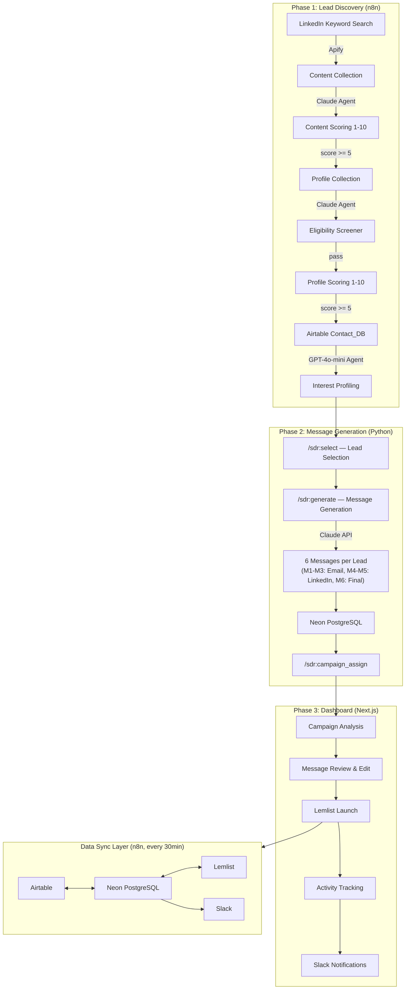

# AI SDR System

End-to-end AI-powered Sales Development pipeline that automatically discovers potential leads from LinkedIn, generates personalized multi-channel outreach messages using LLMs, and provides an operations dashboard for sales teams to review and launch campaigns.

Built for a 3-person sales team at a B2B SaaS company targeting the global sports performance technology market.

---

## Problem

- Manually discovering and qualifying hundreds of leads across global markets is time-consuming and inconsistent
- Writing personalized cold outreach messages (Email + LinkedIn) for each lead doesn't scale with a small team
- Sales managers switch between Airtable, Lemlist, and Slack to manage campaigns, with no unified view of pipeline status

## Solution

A three-phase automated pipeline:

```
Phase 1: Lead Discovery          Phase 2: Message Generation       Phase 3: Operations Dashboard
(n8n + Apify + AI Agents)        (Python + Claude API)              (Next.js + Prisma + Neon)

LinkedIn keyword search           Lead selection & ranking           Message review & editing
        |                                 |                                  |
  AI content scoring              6 personalized messages             One-click Lemlist launch
        |                         per lead (Email + LinkedIn)                |
  Profile collection                      |                          Real-time activity tracking
        |                         Neon PostgreSQL storage                     |
  2-stage AI filtering                    |                          Slack notifications
  (eligibility + scoring)         Campaign assignment                 (country-based routing)
        |                                                                    |
  Interest profiling                                                 Performance reporting
        |
  Airtable Contact_DB
  (800+ qualified profiles)
```

---

## System Architecture



---

## Phase 1: Lead Discovery Pipeline

**Stack**: n8n + Apify + Claude AI + GPT-4o-mini

Automated weekly pipeline that discovers and qualifies leads from LinkedIn content engagement.

### Workflow

1. **Content Collection** (weekly, scheduled) -- Apify scrapes LinkedIn posts matching target keywords (e.g., "GPS tracking athletes", "sports performance", "load monitoring")
2. **Content Scoring** -- Claude AI Agent scores each post 1-10 on technical depth, industry insight, and product relevance. Only posts scoring 5+ are kept.
3. **Profile Collection** -- Apify collects profiles of users who engaged (liked/commented/shared) with qualified posts
4. **Eligibility Screening** -- Binary AI filter with two gates:
   - Gate 1: Currently affiliated with an outdoor sports club/team (not indoor sports, not media/agency)
   - Gate 2: Not employed at a competitor company
5. **Profile Scoring** -- AI scores each profile 1-10 on role relevance, industry fit, and seniority. Only 5+ profiles enter the pipeline.
6. **Interest Profiling** -- For each qualified profile, Apify collects their 10 most recent LinkedIn interactions. GPT-4o-mini summarizes professional interests in 2-4 sentences for message personalization.

**Result**: 800+ qualified, scored, and interest-profiled leads in Airtable Contact_DB.

> See [docs/lead-discovery.md](docs/lead-discovery.md) for workflow details and AI agent prompt designs.

---

## Phase 2: AI Message Generation

**Stack**: Python 3.11 + Anthropic Claude API + asyncio + asyncpg

Three Claude Code skills orchestrate the pipeline:

### `/sdr:select` -- Lead Selection
- Queries Airtable Contact_DB + Neon campaign history
- Classifies accounts (client/negotiating/churned/lost_deal) to prevent contacting existing customers
- Checks active campaigns to avoid duplicate outreach
- Ranks and recommends top 20 leads based on AI score, interactions, and email availability

### `/sdr:generate` -- Message Generation
- Calls `generate_messages.py` with confirmed lead IDs
- Generates 6 personalized messages per lead via Claude API (claude-sonnet-4-6):

| Message | Channel | Length | Approach |
|---------|---------|--------|----------|
| M1 Initial | Email + LinkedIn | 100-125 words | Problem framing, hypothesis-based |
| M2 Follow-up | Email + LinkedIn | 100-125 words | New case study, engagement signal |
| M3 Re-engagement | Email + LinkedIn | 100-125 words | Strong hook, data-driven |
| M4 Connection | LinkedIn | < 200 chars, 3 sentences | Relevance-based connection request |
| M5 Chat | LinkedIn | ~100 words | Trust building, conversational |
| M6 Final | Email + LinkedIn | 100-125 words | Different angle + exit statement |

- Parallel processing with `asyncio` + `Semaphore(10)` for concurrent API calls
- Automatic M4 regeneration if exceeding LinkedIn's 200-character limit (max 2 retries)
- Results saved to Neon PostgreSQL with channel-specific formatting (HTML `<br>` for email, `\n` for LinkedIn)

### `/sdr:campaign_assign` -- Campaign Assignment
- Links generated messages to Lemlist campaigns
- Updates assignee and sequence type (email vs. LinkedIn) in Neon DB
- Prepared leads appear in the dashboard's "To Launch" queue

---

## Phase 3: Operations Dashboard

**Stack**: Next.js 16 + React 19 + Prisma 7 + Neon PostgreSQL + Tailwind CSS + shadcn/ui

A web dashboard for sales managers to review AI-generated messages, launch campaigns, and track engagement.

### Features

- **Campaign Analysis** -- Per-campaign view with summary cards (active/replied/bounced/waiting), lead tables split into "Launched" and "To Launch" sections
- **Message Review & Edit** -- Full message sequence view with inline editing. Changes can be applied to Lemlist or discarded.
- **One-Click Lemlist Launch** -- Batch-select pending leads and add them to Lemlist campaigns with a single button click
- **Profile Analysis** -- Cross-campaign view of all contacts with AI scores, states, filtering, and search
- **Activity Tracking** -- Real-time visibility into email opens, clicks, replies, LinkedIn accepts
- **Slack Integration** -- Automated thread notifications per lead, routed to country-specific channels (KR/JP/APAC/EMEA/NAM)
- **Performance Reporting** -- `/sdr:report` skill generates funnel metrics, per-campaign breakdowns, and action items, posted to Slack
- **Auth** -- Google OAuth + Google Sheets-based role management (Admin/Manager)

### Data Sync

n8n workflow runs every 30 minutes, syncing data across all systems:

| Section | Flow | Method |
|---------|------|--------|
| A | Airtable Contact_DB -> Neon contacts | Upsert by airtable_id |
| B | Lemlist campaigns -> Neon campaigns | Upsert by campaign_id |
| C | Lemlist leads (CSV export) -> Neon campaign_leads | Upsert by lemlist_lead_id |
| D | Lemlist activities -> Neon activities | Upsert by lemlist_activity_id |
| E | New activities -> Slack threads | Country-based channel routing |
| F | sync_log record | Completion audit |

---

## Prompt Engineering

This project includes 5 purpose-built AI agent prompts, each designed for a specific stage of the pipeline:

| Agent | Model | Purpose | Design |
|-------|-------|---------|--------|
| Content Scorer | Claude (n8n) | Rate LinkedIn post relevance 1-10 | 3-axis scoring: technical depth + industry insight + product relevance |
| Eligibility Screener | Claude (n8n) | Binary lead qualification | 2-gate filter: outdoor sports affiliation + competitor exclusion |
| Profile Scorer | Claude (n8n) | Rate lead quality 1-10 | 3-axis scoring: role relevance + industry fit + seniority |
| Interest Profiler | GPT-4o-mini (n8n) | Summarize professional interests | Structured output from 10 recent LinkedIn interactions |
| Message Generator | Claude Sonnet (Python) | Generate 6 personalized messages | Knowledge base injection + prospect profile context |

> See [docs/prompts/](docs/prompts/) for full prompt designs with system prompts, structured outputs, and scoring criteria.

---

## Tech Stack

| Layer | Technology | Purpose |
|-------|-----------|---------|
| Lead Discovery | n8n + Apify | Workflow automation + LinkedIn scraping |
| AI Scoring/Filtering | Claude API, GPT-4o-mini | Content/profile scoring, interest profiling |
| Message Generation | Python + Anthropic SDK (claude-sonnet-4-6) | Personalized multi-channel message creation |
| Workflow Orchestration | Claude Code (custom skills) | Semi-automated lead selection, generation, assignment |
| Database | Neon PostgreSQL + Prisma ORM | Contacts, messages, campaigns, activities, sync log |
| Data Source | Airtable REST API | Lead profiles, account data |
| Campaign Execution | Lemlist API | Email + LinkedIn sequence management |
| Dashboard | Next.js 16, React 19, Tailwind CSS, shadcn/ui | Operations UI for sales team |
| Notifications | Slack API | Country-routed lead activity alerts |
| Data Sync | n8n (30-min schedule + webhook trigger) | Cross-system synchronization |
| Auth | NextAuth.js + Google OAuth | Role-based access control |

---

## Database Schema

```
contacts          messages           campaigns        campaign_leads      activities
----------        ----------         ----------       ----------------    ----------
airtable_id (PK)  id (PK)            campaign_id (PK) id (PK)             id (PK)
name               contact_id (FK)   name              lemlist_lead_id     campaign_lead_id (FK)
company            m1-m6 fields      status            campaign_id (FK)    type
role               campaign_id       archived          airtable_contact_id occurred_at
ai_score           sequence_type                       state               content
email              generated_at                        sequence_step
country                                                slack_thread_ts
assignee
```

---

## Project Structure

```
ai-sdr-system/
├── pipeline/                        # Phase 2: AI Message Generation
│   ├── generate_messages.py         # Core message generation script
│   ├── .claude/commands/sdr/        # Claude Code skill definitions
│   │   ├── select.md                # /sdr:select
│   │   ├── generate.md              # /sdr:generate
│   │   ├── campaign_assign.md       # /sdr:campaign_assign
│   │   └── report.md                # /sdr:report
│   ├── knowledge/                   # Company knowledge base (template)
│   ├── prompts/                     # Claude API system prompt
│   └── requirements.txt
├── dashboard/                       # Phase 3: Operations Dashboard
│   ├── app/                         # Next.js App Router (pages + API routes)
│   ├── components/                  # React components (dashboard, layout, UI)
│   ├── lib/                         # Data fetching, integrations, utilities
│   ├── prisma/schema.prisma         # Database schema
│   └── package.json
├── docs/                            # Phase 1 documentation + prompt designs
│   ├── lead-discovery.md            # n8n pipeline architecture
│   └── prompts/                     # AI agent prompt collection
└── .env.example                     # Required environment variables
```

---

## Setup

```bash
# Clone
git clone https://github.com/your-username/ai-sdr-system.git
cd ai-sdr-system

# Pipeline (Python)
cd pipeline
pip install -r requirements.txt
cp .env.example .env   # Fill in API keys

# Dashboard (Next.js)
cd ../dashboard
npm install
npx prisma generate
```

See [.env.example](.env.example) for required environment variables.

---

## Results

- 800+ qualified leads discovered and profiled from LinkedIn
- 6 personalized messages generated per lead across Email and LinkedIn channels
- Async parallel processing handles 10 concurrent API calls
- 30-minute auto-sync keeps all systems (Airtable, Lemlist, Neon, Slack) in sync
- Sales team operates from a single dashboard instead of switching between 4 tools
