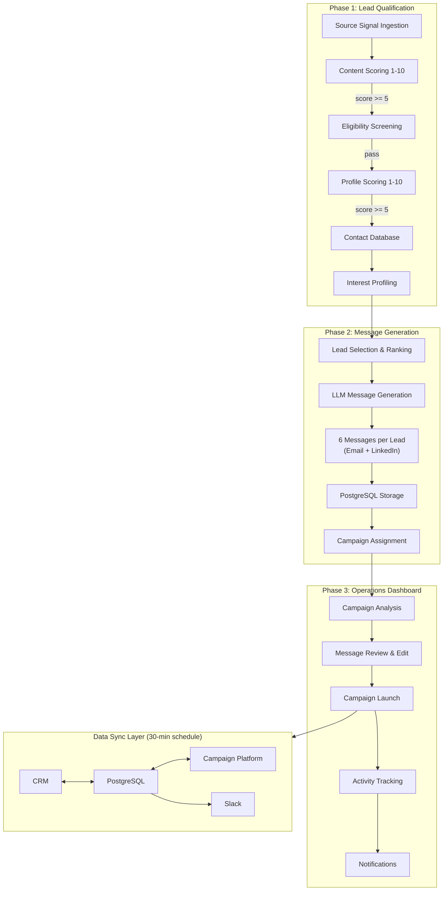

# AI SDR Outreach System

> **Public portfolio version.** This repository is a sanitized reconstruction of an AI-assisted SDR workflow built for a global B2B SaaS sales team. All company-sensitive data, customer/prospect information, credentials, internal URLs, proprietary business logic, and production configurations have been removed or replaced with synthetic examples. This repo demonstrates architecture, workflow design, prompt engineering patterns, data modeling, integration logic, human-in-the-loop operations, and evaluation thinking.

---

## Why I Built This

A small (3-person) global B2B SaaS sales team needed a scalable way to discover, qualify, personalize, review, and launch outreach — without switching between fragmented CRM, campaign management, and manual workflows. The existing process involved manually sourcing leads, writing individual messages, and coordinating across Airtable, Lemlist, and Slack with no unified pipeline or quality control.

I designed and built an end-to-end AI-assisted SDR system that automates lead qualification, generates knowledge-grounded personalized messages, provides a human-review dashboard, and handles campaign handoff — all backed by PostgreSQL-based workflow state tracking.

---

## My Role

I owned the full-stack design and implementation:
- **Workflow architecture**: Designed the three-phase pipeline (lead qualification → message generation → operations dashboard)
- **Prompt engineering**: Built 5 purpose-specific AI agent prompts with structured outputs, scoring rubrics, and behavioral guardrails
- **Data model**: Designed the PostgreSQL schema (contacts, messages, campaigns, campaign_leads, activities, sync_log) with cross-system sync logic
- **Human-review loop**: Built the dashboard for message review, inline editing, approval/rejection, and one-click campaign launch
- **Integration logic**: Connected Airtable (CRM), Lemlist (campaigns), Slack (notifications), and Neon PostgreSQL (state tracking)
- **QA and evaluation**: Implemented JSON parse validation, message length enforcement, M4 character-limit retry logic, duplicate outreach prevention, and existing customer exclusion

---

## What This Public Version Demonstrates

- **AI-assisted lead qualification** — Multi-stage scoring with binary eligibility gates and 3-axis quality assessment
- **LLM-based profile analysis** — Interest profiling from content engagement signals, summarized for downstream personalization
- **Knowledge-grounded message generation** — 6 personalized outreach messages per lead, grounded in an injected company knowledge base
- **Human-in-the-loop review** — Dashboard for reviewing, editing, approving, or rejecting AI-generated messages before campaign launch
- **Campaign handoff** — One-click batch launch to campaign management platform with automatic data sync
- **Notification and reporting** — Country-based Slack channel routing for lead activity alerts, plus automated performance reports
- **PostgreSQL-backed workflow state tracking** — Full pipeline state managed in a relational database with 30-minute cross-system sync
- **CRM-style operating data model** — Contacts, qualification scores, generated messages, review status, campaign status, and activity logs in a unified schema

---

## Architecture

```
Source Signals        Lead Qualification       Message Generation      Human Review         Campaign Handoff
(configurable         (n8n workflow            (Python + LLM API)      (Next.js dashboard)  (API integration)
source adapters)      automation)

Market signal     →   Content scoring      →   Lead selection      →   Message review   →   Campaign assignment
ingestion             (3-axis, 1-10)           & ranking                & inline editing     & batch launch
                      ↓                        ↓                       ↓                    ↓
                  Eligibility screening    6 personalized          Approve/reject       Activity tracking
                  (binary 2-gate filter)   messages per lead       workflow             & Slack notifications
                      ↓                        ↓                                            ↓
                  Profile scoring          Knowledge base                               Performance
                  (3-axis, 1-10)           injection                                    reporting
                      ↓
                  Interest profiling
                  (content engagement
                  summarization)
```

This public version uses synthetic sample data. The original internal implementation integrated third-party data collection and CRM-style workflows; this public version uses mock adapters and synthetic sample data to demonstrate the same architecture.

> Any production use of similar data collection must comply with source-platform terms, privacy requirements, and applicable data protection rules.

### System Flow (Mermaid)



---

## Data Model

| Entity | Key Fields | Purpose |
|--------|-----------|---------|
| contacts | name, company, role, ai_score, email, country, assignee | Lead profiles with qualification scores |
| messages | contact_id, m1-m6 fields, campaign_id, sequence_type | AI-generated message sequences per lead |
| campaigns | campaign_id, name, status, archived | Campaign metadata and lifecycle state |
| campaign_leads | lemlist_lead_id, campaign_id, state, sequence_step | Per-lead campaign progress tracking |
| activities | campaign_lead_id, type, occurred_at, content | Engagement event log (opens, clicks, replies) |
| sync_log | synced_at, source | Cross-system sync audit trail |

---

## Guardrails

- **Duplicate outreach prevention** — Active campaign check before lead selection; leads already in non-archived campaigns are excluded
- **Existing customer exclusion** — Account status classification (client/negotiating/churned/lost_deal) blocks outreach to current customers
- **Competitor exclusion** — Binary eligibility gate rejects leads employed at competitor companies
- **Human review before campaign launch** — AI drafts messages; humans review, edit, and approve before any outreach is sent
- **Message length validation** — M4 (connection request) enforces a strict character limit with automatic retry logic (max 2 regeneration attempts)
- **Synthetic data only** — This public version contains no real prospect or customer data
- **No production credentials** — All API keys and tokens are environment-variable references with placeholder values only

---

## Evaluation / QA

| Dimension | Method |
|-----------|--------|
| JSON parse success | Response parsing with markdown fence stripping and retry |
| Message completeness | All 14 fields (6 messages x subject/email/linkedin variants) validated per lead |
| Personalization relevance | Knowledge base injection + prospect profile context in every LLM call |
| Character limit compliance | M4 connection request validated against 200-char limit with auto-regeneration |
| Review-ready output rate | Dashboard tracks approve/edit/reject actions per message |
| Campaign handoff readiness | Pre-launch validation: email availability, duplicate check, campaign assignment |
| Failure-mode logging | Per-lead error capture in async batch processing with summary report |

---

## Tech Stack

| Layer | Technology | Purpose |
|-------|-----------|---------|
| Lead Qualification | n8n (workflow automation) | Multi-stage scoring and filtering pipeline |
| AI Scoring/Analysis | Claude API, GPT-4o-mini | Content scoring, profile scoring, interest profiling |
| Message Generation | Python + Anthropic SDK | Async parallel LLM calls with knowledge base injection |
| Workflow Orchestration | Claude Code (custom skills) | Semi-automated lead selection, generation, assignment |
| Database | Neon PostgreSQL + Prisma ORM | Contacts, messages, campaigns, activities, sync log |
| CRM Integration | Airtable REST API | Lead profiles, account data |
| Campaign Platform | Lemlist API | Email + messaging sequence management |
| Dashboard | Next.js, React, Tailwind CSS, shadcn/ui | Operations UI for review, launch, and tracking |
| Notifications | Slack API | Country-routed activity alerts and performance reports |
| Data Sync | n8n (30-min schedule) | Cross-system synchronization |
| Auth | NextAuth.js + Google OAuth | Role-based access control |

---

## Prompt Engineering

5 purpose-built AI agent prompts, each designed for a specific pipeline stage:

| Agent | Model | Purpose | Design |
|-------|-------|---------|--------|
| Content Scorer | Claude | Rate source signal relevance 1-10 | 3-axis scoring: technical depth + industry insight + product relevance |
| Eligibility Screener | Claude | Binary lead qualification | 2-gate filter: target industry affiliation + competitor exclusion |
| Profile Scorer | Claude | Rate lead quality 1-10 | 3-axis scoring: role relevance + industry fit + seniority |
| Interest Profiler | GPT-4o-mini | Summarize professional interests | Structured output from recent content engagement |
| Message Generator | Claude Sonnet | Generate 6 personalized messages | Knowledge base injection + prospect profile context |

> See [docs/prompts/](docs/prompts/) for full prompt designs with system prompts, structured outputs, and scoring criteria.

---

## Project Structure

```
ai-sdr-outreach/
├── pipeline/                        # Phase 2: AI Message Generation
│   ├── generate_messages.py         # Core message generation script
│   ├── .claude/commands/sdr/        # Claude Code skill definitions
│   │   ├── select.md                # Lead selection skill
│   │   ├── generate.md              # Message generation skill
│   │   ├── campaign_assign.md       # Campaign assignment skill
│   │   └── report.md                # Performance reporting skill
│   ├── knowledge/                   # Company knowledge base (template)
│   ├── prompts/                     # LLM system prompt
│   └── requirements.txt
├── dashboard/                       # Phase 3: Operations Dashboard
│   ├── app/                         # Next.js App Router (pages + API routes)
│   ├── components/                  # React components (dashboard, layout, UI)
│   ├── lib/                         # Data fetching, integrations, utilities
│   ├── prisma/schema.prisma         # Database schema
│   └── package.json
├── sample_data/                     # Synthetic sample data for local review
├── docs/                            # Architecture, prompts, evaluation docs
│   ├── architecture.md
│   ├── evaluation.md
│   ├── human-review-workflow.md
│   ├── privacy-and-redaction.md
│   ├── google-cloud-mapping.md
│   ├── lead-discovery.md
│   └── prompts/                     # AI agent prompt collection
├── SECURITY.md
├── LICENSE.md
└── .env.example                     # Required environment variables (placeholders only)
```

---

## How to Run Locally

### Option 1: Review mode (no credentials needed)

Browse the codebase, read prompt designs in `docs/prompts/`, and inspect synthetic sample data in `sample_data/`.

### Option 2: Dashboard (requires PostgreSQL)

```bash
cd dashboard
cp .env.example .env   # Fill in database URL and auth credentials
npm install
npx prisma generate
npx prisma db push     # Create tables
npm run dev
```

### Option 3: Full pipeline (requires all API credentials)

```bash
# Pipeline
cd pipeline
pip install -r requirements.txt
cp .env.example .env   # Fill in API keys

# Dashboard
cd ../dashboard
npm install
npx prisma generate
npm run dev
```

> The `.env.example` file contains placeholders only. Do not commit production credentials.

---

## What Was Removed

This public version excludes:
- Company-specific knowledge base content (replaced with structural template)
- Real prospect/customer records (replaced with synthetic sample data)
- Production API credentials and tokens
- Internal webhook URLs and service endpoints
- Proprietary sales playbooks and positioning
- Private workflow configuration and channel mappings
- Real campaign data and performance metrics
- Company branding assets (logos replaced with generic placeholders)

---

## Suggested GitHub Topics

`llm` `ai-agents` `sales-automation` `human-in-the-loop` `prompt-engineering` `workflow-automation` `crm` `postgresql` `nextjs` `n8n`

---

## License

This repository is shared as a public portfolio artifact. All rights reserved unless otherwise stated.
