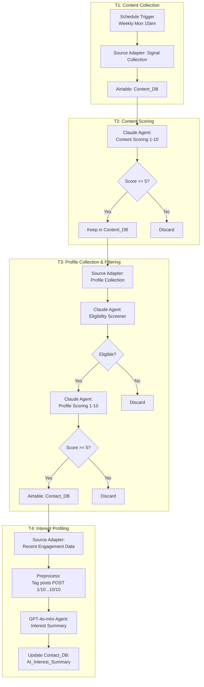

# Phase 1: Lead Discovery Pipeline

> **Note**: This is a public portfolio version. The original implementation used third-party data collection integrations. This documentation describes the architecture and scoring logic; the public version uses synthetic sample data. Any production data collection must comply with source-platform terms and applicable privacy regulations.

Automated weekly pipeline built on **n8n** + **AI Agents** that discovers and qualifies potential leads from public market signal engagement.

---

## Architecture Overview



---

## T1: n8n Workflow Setup

**Trigger**: Schedule -- every Monday at 10:00 AM

**Source adapter task** (configurable per data source)

**Search Keywords**:
- Sports Performance
- GPS tracking athletes
- Injury Prevention sports
- Load Monitoring
- High Performance sport

**Collection Range**: Past 7 days

**Output**: Raw source signals stored in Airtable Content_DB with metadata (author, stats, hashtags, URL).

---

## T2: Content Scoring

An n8n AI Agent node evaluates whether each collected post would attract the target audience (sports scientists, performance coaches, team analysts).

### Scoring Criteria (1-10)

| Axis | Points | What it measures |
|------|--------|-----------------|
| Technical Depth | 1-4 | Specific metrics (high-speed running, metabolic power, load monitoring)? Data/research-backed? |
| Industry Insight | 1-3 | Solves a common pain point in sports performance? Unique perspective? |
| Product Relevance | 1-3 | Alignment with EPTS technology, GPS tracking, injury prevention? |

### Score Guide

- **8-10**: High-level technical analysis, case studies, research-backed insights
- **5-7**: General sports science news, standard training tips
- **1-4**: Promotional ads, personal updates, irrelevant content (noise)

**Filter**: Only posts scoring 5+ are retained in Content_DB.

> See [prompts/content-scoring.md](prompts/content-scoring.md) for the full agent prompt.

---

## T3: Profile Collection & 2-Stage Filtering

For each qualified post, the source adapter collects profiles of users who engaged (liked, commented, shared).

### Stage 1: Eligibility Screener (Binary Filter)

A lightweight Claude Agent that applies two hard gates before scoring. Designed to eliminate clear non-fits early, reducing LLM scoring costs.

**Principle**: When in doubt, pass through to scoring. Only reject when clearly certain.

| Gate | Pass | Fail |
|------|------|------|
| **Gate 1: Outdoor Sports Club** | Pro/semi-pro clubs, national federations, university athletics, youth academies | Fitness companies, sports media, tech vendors, corporate wellness |
| **Gate 1: Sport Type** | Football, rugby, AFL, American football, cricket, field hockey, cycling | Basketball, swimming, volleyball, gymnastics, ice hockey, esports |
| **Gate 2: Not a Competitor** | Any non-EPTS company | EPTS/GPS wearable competitors (Catapult, STATSports, Kinexon, etc.) |

**Decision**: `eligible: true` only if both gates pass.

> See [prompts/eligibility-screener.md](prompts/eligibility-screener.md) for the full agent prompt.

### Stage 2: Profile Scoring (Quality Assessment)

Profiles that pass eligibility screening are scored 1-10 on lead quality.

| Axis | Points | What it measures |
|------|--------|-----------------|
| Role Relevance | 1-4 | Would they use, purchase, or influence purchase of tracking technology? |
| Industry Fit | 1-3 | Professional sports, collegiate athletics, national federation, sports science institution? |
| Seniority & Influence | 1-3 | Decision-making power over technology adoption? |

**Filter**: Only profiles scoring 5+ are added to Contact_DB.

> See [prompts/profile-scoring.md](prompts/profile-scoring.md) for the full agent prompt.

---

## T4: Interest Profiling (Reverse Tracking)

For each qualified profile in Contact_DB, the source adapter collects their 10 most recent content engagement data (posts they liked/commented/shared). A GPT-4o-mini agent summarizes professional interests in 2-4 sentences.

### Why GPT-4o-mini?

Cost efficiency -- the internal workflow was designed to support hundreds of qualified profiles. With that volume of individual API calls for profiling, a smaller model provides adequate quality for summarization at significantly lower cost than a larger model. This public version uses synthetic sample data.

### Preprocessing

Raw post content is tagged with position markers before passing to the agent:

```
[POST 1/10]
The role of GPS tracking in modern football has evolved significantly...

[POST 2/10]
New research on hamstring injury prevention shows promising results...
```

Only post body text is used -- metadata (hashtags, URLs, author info) is excluded as it doesn't add meaningful signal for interest profiling.

### Execution Modes

| Mode | Target | Trigger |
|------|--------|---------|
| Automatic (daily) | New profiles with empty AI_Interest_Summary | Daily schedule |
| Manual | Specific profiles or conditional re-collection | Manual trigger |

**Output**: `AI_Interest_Summary` field in Contact_DB -- used as primary input for message personalization in Phase 2.

> See [prompts/interest-profiling.md](prompts/interest-profiling.md) for the full agent prompt.

---

## Airtable Schema

### Content_DB

| Field | Description |
|-------|-------------|
| Content_ID | Unique identifier |
| Content_URL | Source signal URL |
| Content_Text | Post body text |
| Content_Posted_Date | Publication date |
| Content_HashTags | Associated hashtags |
| Author_Name | Post author name |
| Author_Headline | Author's job title |
| Author_ID | Source user ID |
| Stats_Total_Reactions | Reaction count |
| Stats_Comments | Comment count |
| AI_Score_Content | Claude score (1-10) |
| AI_Scoring_Reason | Score justification |
| AI_Category | Classification tier |

### Contact_DB

| Field | Description |
|-------|-------------|
| Contact_Name | Profile name |
| Contact_Profile_URL | Profile URL |
| Contact_Headline | Job title |
| Contact_Experience | Work history |
| Is_Author | Whether they authored (vs. engaged with) the content |
| AI_Interest_Summary | Interest profiling output (T4) |
| AI_Priority_Score | Lead quality score (1-10) |
| AI_Role_Tag | Decision Maker / End User / Influencer |
| AI_Key_Interest | Primary interest keywords |
| Country | Location |
| Email | Email address (if available) |

---

## Design Decisions

### Segmentation Strategy -- Abandoned in Favor of Direct Personalization

The original plan included a segmentation step (grouping leads into interest-based clusters before messaging). This was **abandoned** in favor of direct per-profile message generation, where Claude uses each lead's full profile + interest summary to generate individually tailored messages. This approach proved more effective because:

1. Segment boundaries were arbitrary -- leads often straddled multiple categories
2. Per-profile personalization with Claude produced higher-quality messages than segment-level templates
3. Eliminated an entire pipeline stage, reducing complexity

### Two-Stage Filtering vs. Single-Pass Scoring

The eligibility screener was added after observing that ~40% of collected profiles were clearly unqualified (indoor sports, competitors, non-sports organizations). Running a binary filter first reduces the number of expensive scoring calls.
